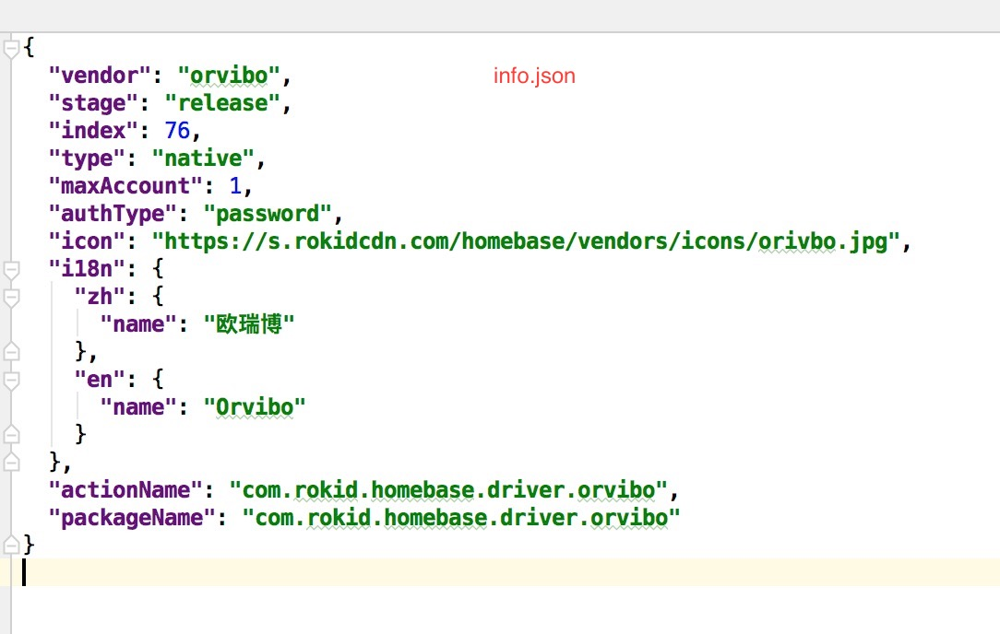
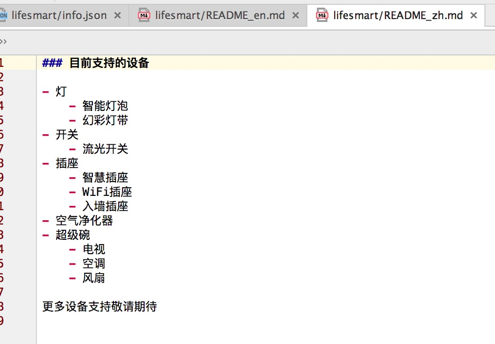

#Rokid Native Driver

我们主要针对的是 第三方厂商 用的 sdk 或者 https请求开发 driver.如是其他方式,请联系 [smarthomeconnect](mailto:smarthomeconnect@rokid.com)
Native Driver 驱动 作为 http server 实现 获取/控制 设备
本文档主要用针对第三方开发者开发可运行在Rokid设备上提供智能家居服务。


##Rokid驱动介绍
- 驱动要作为一个httpserver存在,用于接收Rokid智能家居系统的相关请求。
- 驱动需要在用户使用Rokid手机app进行账号授权的时候提供验证账号的功能。
- 驱动需要在收到控制请求的时候去控制智能设备。
- 驱动需要在收到请求设备列表的时候返回当前所有设备信息。
- 以上操作均需按照Rokid文档返回Json格式数据的执行结果。


##Rokid驱动介绍
- [http server]()
- [/list]()
- [/get]()
- [/execute]()
- [/command]()


##Rokid驱动开发流程

- 获取端口号,默认的端口号获取地址是:<http://127.0.0.1:4201/native-driver/get-port?vendor=%1$s/>,
  其中%1$s需要替换，如换成lifesmart
- 完成httpserver端开发，联系Rokid人员发布驱动dev版本。
- 配置Rokid设备智能家居开发环境:__adb shell setprop persist.system.rokid.homebase.env dev__ 。
- 在浏览器打开Rokid智能家居开发者页面（Rokid设备IP地址+端口号）,如:<10.88.8.88:4201/>;按照提示登录Rokid开发界面,添加驱动,添加账号,搜索设备。
- 配合开发者页面实现驱动的控制、登录请求等开发。[开发者页面](../develop/develop.md)

#驱动开发提示
```
1、 驱动需要配置文件package.json，格式如下,apkDependencies表示驱动依赖的其它apk文件,
    依赖文件需要在"files"内同时添加。
{
	"apkDependencies":["Robot-release.apk","UpnpService-release.apk"],
	"name":"driver-abc",
	"version":"1.0.0",
	"main":"native-driver-abc.apk",
	"files":["native-driver-abc.apk","Robot-release.apk","UpnpService-release.apk"]
}
```

```
2、需提供三个文件,目前需要给到rokid这边。分别是:info.json,README_en.md,README_zh.md,具体如下图
   一定要注意,info.json里面的vendor属性和驱动获取端口号的vendor需保持一致,且actionName需要与驱动
   manifest配置的驱动入口的action保持一致,packageName也需要与驱动的包名保持一致！！！
```




