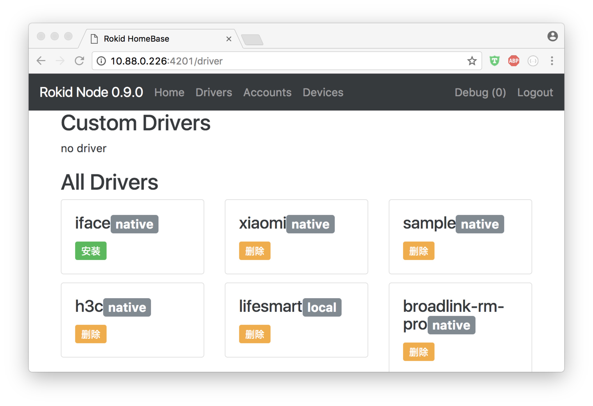

# 开发面板

### 说明
开发面板是驱动的一个快速调试工具,提供了快速调速驱动的界面,通过开发面板可以直接给驱动发送请求,获取设备列表,打开或关闭设备,查看设备状态,以及对设备执行控制指令.

- [如何打开开发面板](#start)
- [使用开发面板](#use)
  - [安装/删除 驱动](#drivers)
  - [授权/登录 驱动](#accounts)
  - [获取/控制 设备列表](#device)

## 如何打开开发面板 

##### 获取 rokid ip 地址

> 通过adb命令获取ip `adb shell ifconfig `  其中 10.88.0.226 就是 ip地址

##### 登录开发面板

> 您也可以通过adb命令来登录 `adb shell curl http://127.0.0.1:4201/log-me-in`

## 使用开发面板 

##### 安装驱动

##### 驱动授权/登录

##### 获取/控制 设备列表
