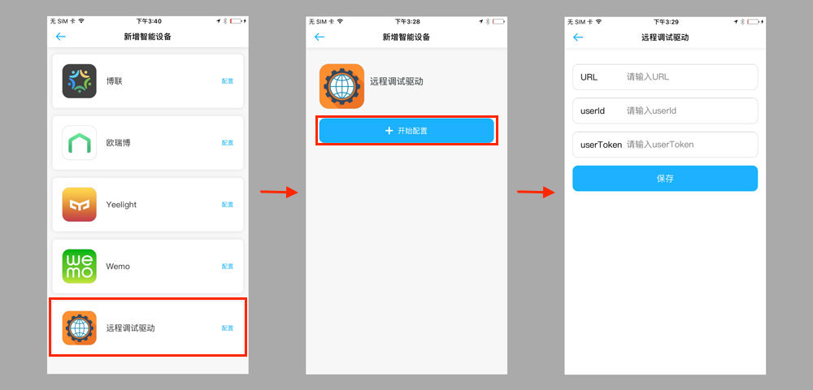

## developer driver

http remote driver 开发者工具

### 需要的参数
- userAuth

```json
{
  "url": "111",
  "userId": "222",
  "userToken": "333"
}
```

### 开发者使用说明

- 首先开发者要启动 http remote driver
- 打开 `Rokid app` ，进入 **智能家居**
- 点击右上角 **+** 号，进入 **新增智能设备** 页面后滑到最底部，点击下面空白处。


- 打开 **开发者模式**


- 点击配置 **远程调试驱动** ,然后 **开始配置**
- 输入 http remote driver 的 `URL` ， 如果需要 Auth 参数，则输入 `userId` 和 `userToken` ，否则可以为空。



- 配置成功后，就可以通过语音与 **月石** 进行搜索智能设备，控制设备等调试。
